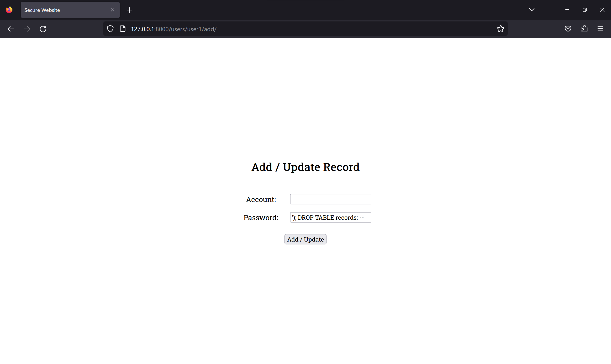
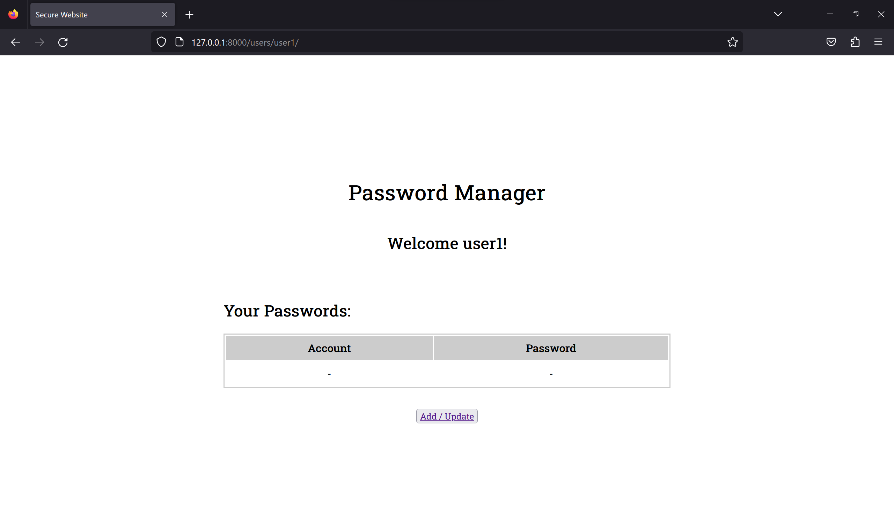

# Cyber Security Base 2023 Project I

*A broken password manager website with 5 flaws and fixes.*

### Setup
There are 2 users included in the database

Username | Password 
-------- | -------- 
user1    | password123
user2    | abcdefg


To run the application:
```
python3 manage.py runserver
```


### Flaw 1: Broken Access Control
Users are able to access the information of other users without authorisation.

The URL of the application takes the following form:
```
/users/<username>
```

With a given username, anyone is able to access the records of that user.

To fix this, the views in `views.py` should verify that the user is logged in to the correct account before allowing access. Adopting a "deny by default" approach prevents users from gaining access to resources they should not be able to access.

- Track user through the [user's session](https://github.com/leslieyip02/cyber-security-base-project-i/blob/4b7317978081cf3e3ce9bf5511a8f1ccf14a0b56/src/pages/views.py#L86-L87)
- Check the user's session and [verify that they are logged in as the correct user](https://github.com/leslieyip02/cyber-security-base-project-i/blob/4b7317978081cf3e3ce9bf5511a8f1ccf14a0b56/src/pages/views.py#L113-L115)


### Flaw 2: Injection
Users can input dangerous data and execute malicious SQL queries.

In the `POST` method of the `add/` view, a SQL query is constructed by [concatenating user input](https://github.com/leslieyip02/cyber-security-base-project-i/blob/4b7317978081cf3e3ce9bf5511a8f1ccf14a0b56/src/pages/views.py#L156-L177). 

```
query = f"""
    INSERT INTO records (username, account, password)
    VALUES ('{username}', '{account}', '{password}')
"""
```

Without proper input validation and sanitation, this can cause the execution of malicious SQL queries. 

One such example is `'); DROP TABLE records; --`:



This wipes all password records from the database.



To fix this, the models from `django.db` should be used instead of manually accessing the SQLite database. Not only is it more convenient, but it also safeguards against such attacks.

- Implement a [model](https://github.com/leslieyip02/cyber-security-base-project-i/blob/4b7317978081cf3e3ce9bf5511a8f1ccf14a0b56/src/pages/models.py#L23-L30) for records
- [Use the model](https://github.com/leslieyip02/cyber-security-base-project-i/blob/4b7317978081cf3e3ce9bf5511a8f1ccf14a0b56/src/pages/views.py#L179-L191) instead of directly accessing `sqlite3`


### Flaw 3: Insecure Design
Users are unable to log out. If another user uses the same device, they could gain access to the original user's information.

After the user logs in, there is no way for them to log out. If the user is using a public device, another user can come along and gain access to that original user's privileged information.

To fix this, a simple logout method can be implemented to clear the user's session.

- [Add a view](https://github.com/leslieyip02/cyber-security-base-project-i/blob/4b7317978081cf3e3ce9bf5511a8f1ccf14a0b56/src/pages/views.py#L98-L105) for logging out
- Modify the [front end](https://github.com/leslieyip02/cyber-security-base-project-i/blob/4b7317978081cf3e3ce9bf5511a8f1ccf14a0b56/src/pages/templates/pages/user.html#L49-L52)


### Flaw 4: Cryptographic Failure
User passwords are stored as plaintext.

Storing passwords without any encryption is dangerous. Encryption can slow down or even prevent hostile actors from taking advantage of data that may have leaked from the database.

To fix this, the passwords should be hashed before saving them to the database. This can be achieved with `make_password` from `django.contrib.auth.hashers`.

- [Encrypt](https://github.com/leslieyip02/cyber-security-base-project-i/blob/4b7317978081cf3e3ce9bf5511a8f1ccf14a0b56/src/pages/models.py#L17-L20) passwords
- [Compare](https://github.com/leslieyip02/cyber-security-base-project-i/blob/4b7317978081cf3e3ce9bf5511a8f1ccf14a0b56/src/pages/views.py#L48-L50) passwords

As an additional layer of security, the passwords can also be salted during encryption.


### Flaw 5: Cross Site Request Forgery (CSRF)
CSRF tokens are not used in `form` elements.

To fix this, each `form` element should include a `csrf_token`.
```
<form>
    
    ...
</form>
```

- [Log In](https://github.com/leslieyip02/cyber-security-base-project-i/blob/4b7317978081cf3e3ce9bf5511a8f1ccf14a0b56/src/pages/templates/pages/login.html#L15-L16)
- [Sign Up](https://github.com/leslieyip02/cyber-security-base-project-i/blob/4b7317978081cf3e3ce9bf5511a8f1ccf14a0b56/src/pages/templates/pages/signup.html#L15-L16)
- [Adding / Updating](https://github.com/leslieyip02/cyber-security-base-project-i/blob/4b7317978081cf3e3ce9bf5511a8f1ccf14a0b56/src/pages/templates/pages/add.html#L15-L16)